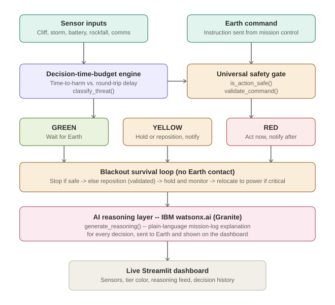
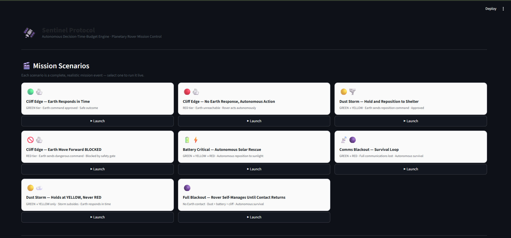

<p align="center">
  
</p>

<p align="center">
  
  
  
  
  
</p>

# Sentinel Protocol

**AI-powered autonomy engine for planetary field robots — deciding, in real time, when to act alone and when to wait for Earth.**

### Contents
- [Problem Statement](#problem-statement)
- [Solution Description](#solution-description)
- [System Architecture](#system-architecture)
- [Threat Scenarios](#threat-scenarios)
- [AI Approach and Architecture](#ai-approach-and-architecture)
- [Mission Scenarios (Dashboard Stories)](#mission-scenarios-dashboard-stories)
- [Rover Status State Machine](#rover-status-state-machine)
- [Live Dashboard](#live-dashboard)
- [Project Structure](#project-structure)
- [Install and Run](#install-and-run)
- [Challenge Theme](#challenge-theme)
- [How IBM Bob Was Used](#how-ibm-bob-was-used)


## Problem Statement

Planetary missions rely on rovers and field robots operating far from Earth, where communication delays range from several minutes (Mars) to complete blackouts during solar interference or terrain obstruction. In these gaps, a rover facing a sudden hazard — a cliff edge, a dust storm, a critical battery drop, falling debris, or a total loss of signal — cannot simply wait for human instruction if the threat will become irreversible before a response can arrive. Mission teams and the robots themselves need a way to know, moment to moment, whether a situation is safe to escalate to Earth or urgent enough to demand immediate autonomous action.

This is not a hypothetical risk. NASA's twin Mars Exploration Rovers, Spirit and Opportunity, both suffered mission-ending failures rooted in exactly this gap. In 2009, Spirit drove into soft sand it could not recognize as dangerous in time, became permanently stuck, and was unable to reposition its solar panels toward the sun — it lost power over the following Martian winter and never made contact again. In 2018, a planet-wide dust storm cut off Opportunity's sunlight for weeks; the rover entered a low-power fault and lost communication with Earth, ending its 14-year mission. In both cases, a system capable of recognizing the danger early and independently choosing a self-preserving action could plausibly have changed the outcome.

Sentinel Protocol is built around this exact gap: giving a field robot the judgment to recognize when a threat cannot wait for Earth, and the ability to choose a genuine self-rescue action — not just stopping in place, but actively repositioning toward safety, entering a low-power holding state, and queuing a full status report to send the moment contact with Earth is restored.

## Solution Description

Sentinel Protocol is an AI decision-support engine that continuously evaluates incoming hazard signals and classifies each situation into one of three response tiers — **Green** (safe to wait for Earth), **Yellow** (take a safe holding action while notifying Earth), or **Red** (act immediately, report afterward). It does this by comparing an estimated *time-to-harm* against the *time it would take to hear back from Earth*, using a transparent, explainable decision-time-budget calculation rather than an opaque model. Every decision Sentinel makes is logged with a plain-language explanation, so mission controllers can trust and audit its choices after the fact.

**Key design principle:** the tier progression is not always GREEN → YELLOW → RED. Situations can stabilise or resolve at YELLOW if Earth responds in time, or the hazard subsides before becoming critical. The system reflects real mission dynamics: sometimes Earth responds within the budget window, sometimes it does not; sometimes a storm builds slowly enough that no autonomous action is ever needed.

## System Architecture

Sentinel Protocol runs as the onboard intelligence of a rover carrying both its scientific instruments and the AI decision-making system itself. Rather than reacting passively to instructions, the rover's AI sits between Earth and the rover's own actuators, playing two distinct safety roles:

1. **Autonomous hazard response** — when the rover detects an emerging danger, it uses the decision-time-budget engine to decide whether there's time to escalate to Earth or whether it must act immediately.

2. **Command validation** — before executing an incoming order from Earth, the rover's AI evaluates whether carrying out that command could lead to harm given what it currently observes. For example, if Earth instructs "move forward" but the sensors show a cliff edge that Earth's last data update didn't capture, the AI intervenes: it halts the command, holds position, and reports the conflict back to Earth rather than executing an unsafe order.

Both roles are implementations of a single underlying principle: **no action — whether ordered by Earth or generated by the rover itself — executes without first passing a safety check.**

<p align="center">
  
</p>

## Threat Scenarios

Sentinel is built around six hazard types, each defined by a detectable sensor signal, an estimated window before the danger becomes irreversible, and a safe fallback action.

| Threat | Sensor signal | Time-to-Harm | Safe fallback |
|---|---|---|---|
| **Cliff edge** | Distance-to-edge shrinking + forward velocity | Seconds (5–15 s) | Stop immediately, reverse 2 m |
| **Dust storm** | Wind speed + dust density rising | Minutes (2–10 min) | Park, lower antenna, shield panels |
| **Battery critical** | Battery % dropping + no sunlight | Minutes–hours | Reposition to sunlight, enter low-power mode |
| **Rockfall / debris** | Vibration sensor + debris distance | Seconds (3–10 s) | Halt, shield instruments, wait |
| **Comms blackout** | Relay elevation dropping toward horizon | Unknown duration | Full autonomy: hold, conserve battery, queue logs |
| **Unclassified anomaly** ¹ | IsolationForest flags unknown pattern | Unknown | Block all non-hold actions pending Earth confirmation |

¹ Raised by the anomaly detection layer when a reading is flagged but doesn't match any known threat signature. Handled by the safety gate's unconditional conservative default.

## AI Approach and Architecture

### Decision-Time-Budget Engine

At the core of Sentinel Protocol is a **decision-time-budget engine**: for every detected hazard, the system estimates *time-to-harm* (TTH) and compares it against the *round-trip communication delay* (RTT) to Earth. A **conservatism multiplier** (a scenario-specific safety margin, 70–100% depending on hazard type) is applied to the raw TTH before comparison:

| Adjusted TTH ÷ RTT | Tier | What the rover does |
|---|---|---|
| > 2 | 🟢 **GREEN** | Wait for Earth's response before acting |
| 1 – 2 | 🟡 **YELLOW** | Take a safe holding action; notify Earth in parallel |
| ≤ 1 | 🔴 **RED** | Act autonomously immediately; notify Earth afterward |

Conservatism multipliers per threat type:

| Threat | Multiplier | Rationale |
|---|---|---|
| `cliff_edge` | 0.80 | Sensor noise — conservative margin |
| `dust_storm` | 0.90 | Storm intensity can escalate quickly |
| `battery_critical` | 0.95 | Discharge rate is fairly predictable |
| `rockfall` | 0.70 | Highly dynamic, worst-case bias |
| `comms_blackout` | 1.00 | Predictable orbital geometry |
| `full_blackout` | 0.90 | Relay already lost; battery drain is predictable |
| `unclassified_anomaly` | 0.75 | Unknown hazard — aggressive caution |

This approach keeps every decision transparent and auditable — there is no black-box classifier, only a clear, explainable calculation a mission controller can verify after the fact.

### AI Reasoning Layer (IBM watsonx.ai / Granite)

Sentinel integrates **IBM watsonx.ai**, calling the `ibm/granite-4-h-small` foundation model via the `/ml/v1/text/chat` endpoint (region: `eu-de`, Frankfurt) to generate natural-language mission-log explanations for every decision tick. Given the full context (threat type, sensor readings, time-to-harm, comm delay, adjusted ratio, tier, and required action), the model produces a concise, professional log entry in the voice of a flight engineer — explaining exactly why the system chose to act autonomously or wait for Earth.

**Example output** (Tick 9, cliff_edge, YELLOW → RED transition):

> *"Sentinel autonomously executed evasive maneuvers to avoid cliff edge, initiating immediate hazard mitigation protocol per RED-tier directive; Earth notification scheduled post-action completion."*

### Command Validation

Every incoming Earth command is checked with `validate_command()` against the current sensor state before execution. If the command would run the rover into an active hazard, it is **blocked**, the rover holds position, and an AI-generated explanation is sent back to Earth. If no conflict exists, the command is approved and passed through unchanged.

### Universal Safety Gate

`is_action_safe()` is the single reusable pre-execution check used by every part of the system. Per-threat blocking rules:

| Threat | Blocked actions | Condition |
|---|---|---|
| `cliff_edge` | All advance/forward commands | adj TTH ≤ RTT |
| `rockfall` | All movement commands | Debris ETA ≤ 30 s |
| `dust_storm` | Antenna / panel deployment | Wind ≥ 15 m/s or optical depth ≥ 0.6 |
| `battery_critical` | All high-power commands | Charge ≤ 10% |
| `comms_blackout` | All comms/transmit commands | Relay elevation ≤ 8° |
| `unclassified_anomaly` | All non-hold actions | Unconditionally |

An absolute safety floor independently blocks all movement and high-power commands when battery ≤ 5%, regardless of whether any named threat is active.

### Blackout Survival Loop

During a **total communications blackout**, `blackout_survival_loop()` runs a continuous multi-phase autonomous sequence:

1. **HOLD** — attempt to stop in place (validated through safety gate)
2. **REPOSITION** — if forward is blocked (e.g. cliff nearby), reverse to safe distance (also validated)
3. **WAIT** — hold and periodically re-check for Earth contact; drain battery slowly
4. **BATTERY\_RESCUE** — if charge drops below threshold, navigate to nearest sunlit charging position
5. **ESCALATE** — if navigation is also blocked, execute emergency full stop

Every proposed action in every phase passes through `is_action_safe()` before execution.

### Anomaly Detection (NASA SMAP/MSL)

An `IsolationForest` model is trained on NASA's public **SMAP/MSL Anomaly Detection Dataset** (517,764 timesteps, 82 telemetry channels, 12.5% anomalous). At runtime, flagged sensor patterns are matched against known threat signatures; unmatched patterns become `unclassified_anomaly` events.

| Metric | Result |
|---|---|
| Accuracy | 0.691 |
| Precision (anomalous) | **1.000** — zero false positives |
| Recall (anomalous) | 0.370 |
| F1 (anomalous) | 0.541 |

The model is pre-trained and committed as `data/anomaly_model.joblib` — no retraining needed at runtime.

## Mission Scenarios (Dashboard Stories)

The dashboard ships with **8 pre-scripted mission stories** covering the full decision lifecycle. Each plays out tick by tick with live sensor data, AI log entries, and Earth command interactions.

| # | Story | Threat | Comm delay | Key event | Expected outcome |
|---|---|---|---|---|---|
| 1 | 🟢🪨 Cliff Edge — Earth Responds in Time | `cliff_edge` | 300 s | `hold_position` sent at tick 2 | APPROVED — rover halts safely |
| 2 | 🔴🪨 Cliff Edge — No Earth Response | `cliff_edge` | 780 s | No Earth cmd | Autonomous RED at tick 9 |
| 3 | 🟡🌪️ Dust Storm — Hold and Shelter | `dust_storm` | 480 s | `move_backward` sent at tick 5 | APPROVED — reposition to shelter |
| 4 | 🚫🪨 Cliff Edge — Move Forward BLOCKED | `cliff_edge` | 780 s | `move_forward` sent at tick 10 | BLOCKED — adj TTH < RTT |
| 5 | 🔋⚡ Battery Critical — Solar Rescue | `battery_critical` | 780 s | No Earth cmd | Autonomous RED at tick 12 |
| 6 | 📡🌑 Comms Blackout — Survival Loop | `comms_blackout` | 780 s | `run_diagnostics` at tick 1 | APPROVED + blackout survival loop |
| 7 | 🟡☁️ Dust Storm — Holds at YELLOW, Never RED | `dust_storm_slow` | 2500 s | `hold_position` at tick 8 | **GREEN → YELLOW only** — no autonomous action needed |
| 8 | 🌑🤖 Full Blackout — Self-Manages Until Contact Returns | `full_blackout` | 780 s | No Earth cmd (contact lost) | Full autonomous survival — dust shields, battery triage, hold until rescue relay at tick ~14 |

> **Story 7** demonstrates that tier progression is **not** always GREEN→YELLOW→RED. When the communication delay is short relative to the threat's build rate, Earth responds within the budget window and no autonomous action is ever triggered.
>
> **Story 8** demonstrates what happens when the relay goes below the horizon *before* the scenario starts — no Earth contact from tick 0. The rover simultaneously manages rising dust (wind climbs to ~25 m/s), a draining battery (from 55%), and a cliff 180 m ahead, all without any commands from Earth. A rescue relay rises over the horizon at tick ~14.

## Rover Status State Machine

Every tick, Sentinel publishes a `robot_state` and a `robot_activity` description — a plain-language sentence describing exactly what the rover is doing at that moment. Both are shown in the dashboard's **Rover Status card** and as pills in the mission timeline.

| State | When | Example activity |
|---|---|---|
| 🚗 `MOVING` | GREEN tier — nominal ops | *"Traversing nominal path. Cliff detected 95 m ahead — drift 0.023 m/s. Monitoring only; awaiting Earth guidance."* |
| 🛑 `HOLDING` | YELLOW + `hold_in_place` | *"⚠️ Brakes applied. Holding position — cliff 82 m ahead. Earth notified; waiting for response within budget window."* |
| 🔄 `REPOSITIONING` | YELLOW + `reposition_to_safety` | *"⚠️ Storm intensifying (wind 3.50 m/s, OD 0.012). Repositioning toward shelter. Panels partially shielded."* |
| ⛔ `STOPPED` | RED — cliff / rockfall / dust | *"🚨 AUTONOMOUS ACTION. Cliff 54 m — TTH < RTT. Emergency reverse engaged. Notifying Earth after manoeuvre."* |
| ⚡ `CHARGING` | RED — battery critical | *"🚨 AUTONOMOUS ACTION. Battery 8.1% — critical threshold. Entering low-power survival mode."* |
| 🛡️ `SURVIVAL` | RED — comms blackout / full blackout | *"🚨 FULL BLACKOUT. No Earth contact. Battery 38.2%, wind 9.60 m/s. Self-managing: dust protection, battery triage, holding position."* |

When the state changes between ticks, the dashboard highlights the transition with a **"Changed from X"** annotation so you can see the exact moment the rover shifted behaviour.

## Live Dashboard

The Streamlit dashboard (`dashboard.py`) is a pure UI layer — all logic lives in `sentinel/`. On every tick it renders:

- **🤖 Rover Status card** — what the robot is doing right now (state badge + plain-language activity sentence + state change annotation)
- **Decision Tier card** — giant colour-coded tier (🟢 / 🟡 / 🔴) with holding action badge and key metrics (TTH, adj. ratio, one-way delay, RTT)
- **📡 Live Sensors panel** — per-tick sensor values with icons and units
- **📊 Threat Budget Ratio bar** — animated bar showing adj TTH ÷ RTT with GREEN/YELLOW/RED colour transitions
- **📡 Earth Command result card** — green APPROVED or red BLOCKED with AI-generated block report
- **🗓️ Mission Timeline** — latest-first log entries with tier colour, state pill, beat annotations, and event pills
- **📋 Tick History table** — colour-coded by tier, collapsible sensor columns, tier distribution summary
- **🌑 Blackout Survival Loop panel** — step cards (HOLD → REPOSITION → WAIT → BATTERY\_RESCUE) for the comms blackout story
- **📡 Custom Earth Command terminal** — send any command against the live sensor state, safety gate evaluates in real time
- **🔍 Safety Gate Probe** — arbitrary action × threat × sensor sandbox for exploring edge cases

<p align="center">
  
</p>

## Project Structure

```
Sentinel Protocol/
├── sentinel/                         ← Python package (all core logic)
│   ├── __init__.py                   ← Exports all public symbols
│   ├── decision_engine.py            ← DecisionTier, Threat, THREAT_CONSERVATISM,
│   │                                    classify_threat()
│   │                                    Keys: cliff_edge, dust_storm, dust_storm_slow,
│   │                                    battery_critical, rockfall, comms_blackout,
│   │                                    full_blackout, unclassified_anomaly
│   ├── simulator.py                  ← TickState (tick, sensors, time_to_harm_s, tier,
│   │                                    holding_action, robot_state, robot_activity),
│   │                                    5 physics models + dust_storm_slow + full_blackout,
│   │                                    choose_holding_action(), _build_robot_status(),
│   │                                    run_scenario()
│   ├── safety_gate.py                ← is_action_safe(), validate_command(),
│   │                                    blackout_survival_loop(), SurvivalStep
│   │                                    Absolute battery floor: blocks all movement/high-power
│   │                                    when charge ≤ 5% regardless of active threats
│   ├── reasoning.py                  ← generate_reasoning(), make_block_report()
│   │                                    IBM watsonx.ai granite-4-h-small, eu-de endpoint
│   ├── anomaly.py                    ← classify_sensor_pattern() — IsolationForest
│   │                                    loaded from data/anomaly_model.joblib
│   └── decision_manager.py           ← DecisionManager, MissionState, EarthCommand
│                                        Timeout, anomaly wiring, command interrupt,
│                                        multi-threat arbitration
├── notebooks/
│   └── sentinel_analysis.ipynb      ← Interactive demonstration of the full pipeline
├── data/
│   ├── labeled_anomalies.csv         ← NASA SMAP/MSL anomaly labels (82 channels)
│   └── anomaly_model.joblib          ← Pre-trained IsolationForest — no retraining needed
├── assets/
│   ├── logo.svg
│   ├── architecture-diagram.svg
│   └── dashboard-screenshot.png
├── dashboard.py                      ← Streamlit mission-control dashboard (pure UI layer)
├── requirements.txt
├── .env                              ← Your credentials — gitignored, never committed
└── .gitignore
```

## Install and Run

### Prerequisites

- Python **3.12** or later
- An **IBM watsonx.ai** account with an active project and API key  
  (Free Lite tier is sufficient; the Granite model used is a small, fast chat model)
- Git

---

### 1 — Clone the repository

```bash
git clone https://github.com/MrabetOussama0/Sentinel-Protocol.git
cd Sentinel-Protocol
```

---

### 2 — Create and activate a virtual environment (recommended)

```bash
# Windows
python -m venv .venv
.venv\Scripts\activate

# macOS / Linux
python -m venv .venv
source .venv/bin/activate
```

---

### 3 — Install dependencies

```bash
pip install -r requirements.txt
```

This installs:

| Package | Purpose |
|---|---|
| `streamlit` | Live mission-control dashboard |
| `ibm-watsonx-ai` | Granite AI reasoning layer |
| `python-dotenv` | Load credentials from `.env` |
| `pandas` | Tick history table in the dashboard |
| `numpy` | Feature engineering for anomaly model |
| `scikit-learn` | IsolationForest anomaly detector |
| `joblib` | Load pre-trained model from `.joblib` |
| `jupyterlab` | Run the analysis notebook |
| `ipykernel` / `nbformat` / `nbconvert` / `nbclient` | Notebook execution support |

---

### 4 — Configure watsonx credentials

Create a `.env` file in the project root (it is already in `.gitignore` — do **not** commit it):

```env
WATSONX_API_KEY=your_ibm_cloud_api_key
WATSONX_PROJECT_ID=your_watsonx_project_guid
```

> **Region note:** the reasoning layer is configured for the `eu-de` (Frankfurt) endpoint (`https://eu-de.ml.cloud.ibm.com`).  
> If your watsonx project is in a different region, update `WATSONX_URL` in [`sentinel/reasoning.py`](sentinel/reasoning.py):
> - Dallas: `https://us-south.ml.cloud.ibm.com`
> - London: `https://eu-gb.ml.cloud.ibm.com`
> - Tokyo: `https://jp-tok.ml.cloud.ibm.com`

> **Offline / no-key mode:** if no `.env` is present, `generate_reasoning()` returns a static fallback string and the dashboard still runs — all 8 scenarios play out fully, only without live AI log text.

---

### 5 — Run the live dashboard

```bash
streamlit run dashboard.py
```

Open the local URL shown in the terminal (usually `http://localhost:8501`).

**Usage:**
1. Click any of the **8 scenario cards** at the top to launch a scenario
2. Watch it run tick by tick — rover status, tier card, sensors, AI log entries all update live
3. When prompted, observe the Earth command result (APPROVED or BLOCKED with AI explanation)
4. After the scenario completes, explore the **Tick History table** and **Summary stats**
5. Use the **📡 Custom Earth Command** expander to test any command against the final sensor state
6. Use the **🔍 Safety Gate Probe** expander to test arbitrary action/threat/sensor combinations

---

### 6 — Explore the notebook

```bash
jupyter lab
```

Open `notebooks/sentinel_analysis.ipynb` in JupyterLab. The notebook demonstrates the full pipeline interactively: decision engine, safety gate, scenario simulator, anomaly detection, and the watsonx reasoning layer — all importing directly from the `sentinel` package.

---

### Clearing the module cache (if you see stale import errors)

If Streamlit shows `ValueError: Unknown threat type` or `AttributeError: 'TickState' has no attribute 'robot_state'` after a code update, Python's `__pycache__` may be stale. Clear it and restart:

```bash
# Windows PowerShell
Get-ChildItem -Path sentinel -Recurse -Filter "*.pyc" | Remove-Item -Force
Remove-Item -Recurse -Force sentinel\__pycache__ -ErrorAction SilentlyContinue

# macOS / Linux
find sentinel -name "*.pyc" -delete
find sentinel -name "__pycache__" -type d -exec rm -rf {} +
```

Then restart the Streamlit server.

---

## Challenge Theme

Advance Space Exploration with AI — August Challenge

## How IBM Bob Was Used

IBM Bob was used across the full build of Sentinel Protocol: designing and implementing the `classify_threat()` decision engine and its `Threat` dataclass; building the tick-by-tick physics simulators for all threat types; integrating IBM watsonx.ai's `granite-4-h-small` model for the natural-language reasoning layer; building the anomaly detection layer on NASA SMAP/MSL telemetry; and refactoring the project from a single exploratory notebook into a properly structured Python package.

Bob also built the entire Streamlit dashboard rewrite — the 8-scenario story system, the per-tick rover status state machine (`robot_state` / `robot_activity`), the Earth command interaction panels, the mission timeline with event pills and beat annotations, the blackout survival loop panel, the custom command terminal, and the safety gate probe sandbox. Throughout, Bob tracked and fixed all architectural gaps identified in code review: the absolute battery safety floor, anomaly tier wiring, command interrupt logic, multi-threat validation, and the `TickState` field additions — surfacing configuration decisions for explicit approval rather than assuming defaults, and iterating on each component until all 8 scenarios passed end-to-end verification.
